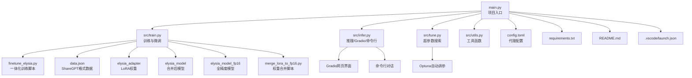

# 往事乐土 Elysian-Realm 
> **回应我吧，爱莉希雅！！**<br>
> **赐予爱莉希雅——第二次生命！！**<br>
- 本项目使用QLoRA方法微调LLM，使爱莉希雅获得第二次生命
- ~~其实就是可视化大模型微调啦，只是这个项目整合了unsloth，cometml，optuna，gradio等工具，实现可视化，全自动，集合微调与推理为一体的大模型微调项目（？长难句起手）~~

> [!WARNING]
> - 本项目处于**活跃开发及重构阶段**，功能和 API 可能随时调整。
> - 功能尚未完善，欢迎各位提交PR，有问题可以提交 Issue 或者 Discussion。
> - 由于本项目正持续迭代，可能存在~~亿~~些小bug。

## 训练模型
### 环境配置

#### 软件要求
- Python 3.10
- CUDA Toolkit 11.8 或更高（建议与PyTorch版本匹配）
- PyTorch 2.0 及以上
- Transformers 4.26 及以上
- Datasets 2.10 及以上
- Tokenizers 0.13 及以上
- scikit-learn、matplotlib、tensorboard、jupyter、trl、peft、unsloth、psutil 等（详见 requirements.txt）

#### 硬件要求
- NVIDIA 显卡，建议显存24GB及以上（如RTX 3090/4090/A6000等，7B模型最低20GB显存可运行，推荐更高），最低至少需要显存4GB，8~12G也可，16G更好
- 推荐SSD硬盘，剩余空间至少50GB
- 推荐内存32GB及以上

## 项目架构



## TO DO List
- [x] 基础功能
    - [x] 基于QLoRA方法微调大模型
    - [x] 支持ShareGPT格式数据集
    - [x] 支持断点续训与自动保存/加载检查点
    - [x] 支持TensorBoard日志与本地可视化
    - [x] 支持LoRA权重合并与GGUF导出
    - [x] 支持命令行推理与简单测试脚本
    - [x] 支持训练参数自定义与详细注释
    - [x] 支持训练/验证集分割与标准化
- [ ] 项目结构与模块化
    - [ ] 项目结构模块化（main.py入口，src/目录多模块）
    - [ ] VSCode调试支持（launch.json）
- [ ] 推理与交互
    - [ ] Gradio网页对话（多轮对话，OpenAI消息格式，端口可配）
    - [ ] 命令行推理（main.py --mode infer）
    - [ ] 支持未来Gradio升级的消息格式
- [ ] 训练与评估增强
    - [ ] Comet ML训练可视化集成
    - [ ] Optuna超参数自动搜索（main.py --mode tune）
    - [ ] 数据增强（nlpaug，同义词替换/插入等）
    - [ ] 详细评估指标（loss、perplexity、accuracy、recall、f1等）
    - [ ] 内存监控（训练/评估阶段自动打印）
    - [ ] 兼容ShareGPT格式自动处理eos token
    - [ ] 训练参数支持Optuna自动搜索
    - [ ] 支持更多断点续训与自动恢复
- [ ] 更多功能持续开发中...

### 对于项目未来的一些幻想（？
- [ ] 成为你的赛博桌宠
    - [ ] 接入TTS  (什么我居然还得微调VITS吗💦)
    - [ ] 接入VUP/MCP?
- [ ] 接入硬件
    - [ ] esp32？
    - [ ] ~~接入**宇树机器人**，给她穿上`kigurumi`(?)，成为你的*赛博女友*(???)~~  (不可能，绝对不可能)

## 使用方法

### 1. 准备运行环境
- 安装python<br>
   ~~自己去官网下，这不用我教吧~~
- 安装CUDA工具包<br>
   ~~自己去官网下，这不用我教吧~~
- 创建虚拟环境
   ```BASH
      python -m venv venv
      #激活虚拟环境
      #在 Windows 上：
      \venv\Scripts\activate
      #在Linux上：
      source myenv/bin/activate
   ```
- 安装依赖
   ```BASH
      pip3 install torch torchvision torchaudio --index-url https://download.pytorch.org/whl/cu126
      pip install -r requirements.txt -i https://pypi.tuna.tsinghua.edu.cn/simple
   ```
### 2. 准备数据集
- 你需要在根目录下准备好数据集，格式**严格遵循**`ShareGPT Fomat`，并将其保存在项目根目录下，保存为`json`格式<br>
- 以下是例子：<br>
   ```JSON
      [
         {
            "conversations": [
               {
                  "from": "human",
                  "value": "芽衣：这些敌人也都是你的「记忆」吧？看来它们不太欢迎我呢。但我没想到，连你都会受到攻击。"
               },
               {
                  "from": "gpt",
                  "value": "爱莉希雅：不用那么惊讶，这里是有些与众不同，但毕竟也是「往世乐土」的一部分，和你见过的其他区域原理相同，没什么差别。 哦对，还没向你正式介绍呢。刚才说到一半就被这群小家伙打断了…… 欢迎来到由「至深之处」保存的，往世乐土最深的秘密—— 由「爱莉希雅」的记忆组成的，完全还原「爱莉希雅」一生所爱的，「爱莉希雅」的心象世界。 如你所见，它就像一切美丽事物的凝聚，和平而永恒的梦幻仙境，立于所有理想尽头的无瑕乐园。 不知道「永世乐土」这个名字……能否让你充满好奇呢？"
               }
               // ......  
               // 可有多组对话
            ]
         }
         // ......  
         // 可有多个conversations
      ]
   ```
### 3. 调整训练参数并启动微调训练 
- 运行`finetune_elysia.py`启动模型微调
   ```bash
   python ./finetune_elysia.py
   ```

#### 训练参数调整说明

- **对模型质量的影响：**
  - `num_train_epochs`：训练轮数，越大模型越能拟合数据，但过大易过拟合。小数据集建议3-5，大数据集可适当增加。
  - `learning_rate`：学习率，过大易震荡，过小收敛慢。一般`2e-5`~`5e-5`，小数据集建议更小。
  - `per_device_train_batch_size`：每卡batch size，越大训练越快但显存占用高。小显存建议1-2，大显存可4-8。
  - `gradient_accumulation_steps`：梯度累积步数，配合batch size调节显存压力。
  - `lora_alpha`、`r`：LoRA参数，越大表达能力越强但显存占用高。
  - `early_stopping_patience`：早停耐心，防止过拟合。

- **对机器性能的影响：**
  - `per_device_train_batch_size`、`gradient_accumulation_steps`：直接影响显存占用。
  - `dataloader_num_workers`：数据加载线程数，CPU多可适当增大。
  - `gradient_checkpointing`：开启可节省显存但训练变慢。
  - `fp16`/`bf16`：混合精度加速，建议开启。

#### 参数调整方法

- 修改 `finetune_elysia.py` 中 `TrainingArguments` 相关参数即可。
- 例：  
   ```python
   training_args = TrainingArguments(
      num_train_epochs=5,
      learning_rate=2e-5,
      per_device_train_batch_size=2,
      gradient_accumulation_steps=2,
      # ...其他参数...
   )
  ```


### 4. 使用TensorBoard观察训练并调整参数

- 启动训练时会自动记录日志到 `./logs` 目录。
- 训练过程中可用如下命令实时查看曲线：
  ```bash
  tensorboard --logdir=./logs --host=0.0.0.0
  ```
- 浏览器访问 http://localhost:6006 查看loss、perplexity等指标曲线。
- 根据曲线调整参数：
  - loss下降缓慢：可适当增大学习率或训练轮数。
  - loss震荡或上升：可减小学习率或增大early stopping耐心。
  - 验证集loss早早不降：可减少epoch或增大early stopping耐心。

### 5. 简单测试模型
- 你可使用`test_model.py`对模型进行简单测试
   ```bash
   python ./test_model.py
   ```
- 在显示`请输入：`时可以进行输入
### 6. 导出GGUF格式（llama.cpp推理）合并LoRA权重并导出FP16模型

- 训练完成后，运行`merge_lora_to_fp16.py`将LoRA权重合并到全精度基础模型，导出标准HuggingFace格式：
  ```python
   python ./merge_lora_to_fp16.py
  ```
- 使用llama.cpp的转换脚本，将合并后的模型目录导出为GGUF格式：
  ```bash
  python llama.cpp/convert_hf_to_gguf.py ./elysia_model_fp16 --outfile ./output.gguf
  ```
- 注意：只能用合并后的全精度模型目录（如`elysia_model_fp16`），不能用adapter目录直接转换。

---

## 注意事项
> 本应用生成内容来自人工智能模型，由 AI 生成，请仔细甄别，请勿用于违反法律的用途，AI 生成内容不代表本项目团队的观点和立场。

## 贡献者

<a href="https://github.com/LittleSadSheep/Elysian-Realm/graphs/contributors">
  
</a>


## Star历史

[](https://star-history.com/#LittleSadSheep/Elysian-Realm&Date)

欢迎PR和Star！


---

如有问题欢迎提issue或讨论！

## 

---

## 新增功能详细说明

### 1. 项目结构模块化

- 项目已拆分为 `main.py` 入口文件和 `src/` 目录下的多个功能模块，包括：
  - `src/train.py`：训练与微调主逻辑，支持数据增强、日志、评估等。
  - `src/infer.py`：推理与Gradio网页对话、命令行对话。
  - `src/tune.py`：超参数自动搜索（Optuna）。
  - `src/utils.py`：数据格式化、评估指标、内存监控等工具函数。
- 便于维护、扩展和调试。

### 2. Gradio网页对话

- 运行 `python main.py --mode web` 可启动Gradio网页界面，支持与微调后的爱莉希雅模型进行多轮对话。
- 支持消息格式与OpenAI一致，兼容未来Gradio升级。
- 支持自定义端口，默认7861，避免端口冲突。

### 3. 命令行推理

- 运行 `python main.py --mode infer` 可在命令行与模型交互，适合快速测试和脚本集成。

### 4. 实验追踪与可视化（Comet.ml）

- 集成 [Comet.ml](https://www.comet.com/)，训练过程自动上传loss、perplexity、学习率、梯度等指标。
- 支持在线和本地可视化，便于分析和对比实验。
- 你可以在训练过程中用 `experiment.log_metrics`、`experiment.log_parameters`、`experiment.log_model` 等API记录参数、指标和模型。

### 5. Optuna超参数自动搜索

- 运行 `python main.py --mode tune` 自动搜索最优训练超参数（如学习率、batch size、LoRA参数等）。
- 支持自定义搜索空间和评估指标，自动保存最佳结果。

### 6. 数据增强

- 集成 [nlpaug](https://github.com/makcedward/nlpaug) 数据增强库，支持同义词替换、随机插入等多种增强方式。
- 可在训练前对数据集进行增强，提高模型泛化能力。

### 7. 详细评估指标

- 训练和验证阶段支持多种评估指标，包括：
  - 损失（loss）
  - 困惑度（perplexity）
  - 准确率（accuracy）
  - 召回率（recall）
  - F1分数（f1）
- 便于全面评估模型性能。

### 8. 内存监控

- 训练和评估阶段自动监控并打印内存占用，便于排查OOM等问题。

### 9. VSCode调试支持

- 提供 `.vscode/launch.json`，可一键在VSCode中调试和运行不同模式（训练、推理、网页、调参）。

### 10. 兼容ShareGPT格式

- 数据集严格支持ShareGPT格式，自动处理对话格式、eos token等，兼容主流开源对话数据。

### 11. 训练参数可配置

- 所有关键训练参数（如batch size、学习率、LoRA参数等）均有详细注释，便于自定义和调优。
- 支持通过Optuna自动搜索最优参数组合。

### 12. 其它增强

- 支持断点续训、自动保存和加载检查点。
- 支持TensorBoard日志，便于本地可视化。
- 支持LoRA权重合并与GGUF导出，兼容llama.cpp等推理框架。

---

如需体验新功能，请参考本README中的环境配置和使用方法，或直接运行：

```bash
python main.py --help
```

查看更多支持的模式和参数。